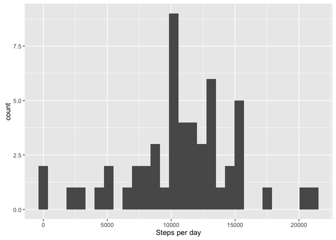
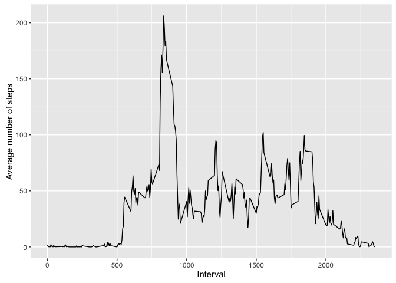
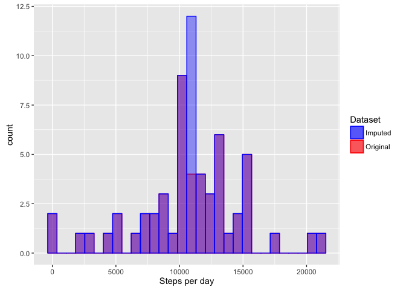
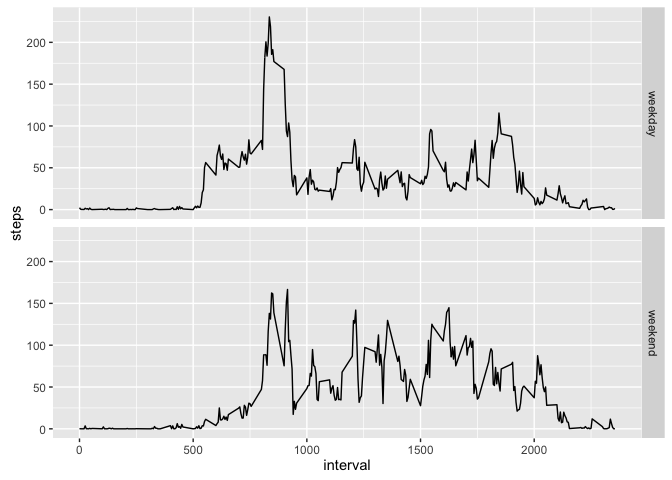

# Reproducible Research: Peer Assessment 1


## Loading and preprocessing the data

We first unzip the file containing the data and then load it using the `read.csv` function.


```r
unzip("activity.zip")
activity <- read.csv("activity.csv")
str(activity)
```

```
## 'data.frame':	17568 obs. of  3 variables:
##  $ steps   : int  NA NA NA NA NA NA NA NA NA NA ...
##  $ date    : Factor w/ 61 levels "2012-10-01","2012-10-02",..: 1 1 1 1 1 1 1 1 1 1 ...
##  $ interval: int  0 5 10 15 20 25 30 35 40 45 ...
```

We can see that the results are stored in the `activity` dataframe, consisting of 17568 observations of 3 variables. The `date` variable contains factors, which will be more useful if represented as Date objects.


```r
activity$date <- as.Date(activity$date, "%Y-%m-%d", tz="UTC")
str(activity)
```

```
## 'data.frame':	17568 obs. of  3 variables:
##  $ steps   : int  NA NA NA NA NA NA NA NA NA NA ...
##  $ date    : Date, format: "2012-10-01" "2012-10-01" ...
##  $ interval: int  0 5 10 15 20 25 30 35 40 45 ...
```

Using the `unique` function, we can take a look to see how the interval is encoded.


```r
unique(activity$interval)
```

```
##   [1]    0    5   10   15   20   25   30   35   40   45   50   55  100  105
##  [15]  110  115  120  125  130  135  140  145  150  155  200  205  210  215
##  [29]  220  225  230  235  240  245  250  255  300  305  310  315  320  325
##  [43]  330  335  340  345  350  355  400  405  410  415  420  425  430  435
##  [57]  440  445  450  455  500  505  510  515  520  525  530  535  540  545
##  [71]  550  555  600  605  610  615  620  625  630  635  640  645  650  655
##  [85]  700  705  710  715  720  725  730  735  740  745  750  755  800  805
##  [99]  810  815  820  825  830  835  840  845  850  855  900  905  910  915
## [113]  920  925  930  935  940  945  950  955 1000 1005 1010 1015 1020 1025
## [127] 1030 1035 1040 1045 1050 1055 1100 1105 1110 1115 1120 1125 1130 1135
## [141] 1140 1145 1150 1155 1200 1205 1210 1215 1220 1225 1230 1235 1240 1245
## [155] 1250 1255 1300 1305 1310 1315 1320 1325 1330 1335 1340 1345 1350 1355
## [169] 1400 1405 1410 1415 1420 1425 1430 1435 1440 1445 1450 1455 1500 1505
## [183] 1510 1515 1520 1525 1530 1535 1540 1545 1550 1555 1600 1605 1610 1615
## [197] 1620 1625 1630 1635 1640 1645 1650 1655 1700 1705 1710 1715 1720 1725
## [211] 1730 1735 1740 1745 1750 1755 1800 1805 1810 1815 1820 1825 1830 1835
## [225] 1840 1845 1850 1855 1900 1905 1910 1915 1920 1925 1930 1935 1940 1945
## [239] 1950 1955 2000 2005 2010 2015 2020 2025 2030 2035 2040 2045 2050 2055
## [253] 2100 2105 2110 2115 2120 2125 2130 2135 2140 2145 2150 2155 2200 2205
## [267] 2210 2215 2220 2225 2230 2235 2240 2245 2250 2255 2300 2305 2310 2315
## [281] 2320 2325 2330 2335 2340 2345 2350 2355
```

This shows that the interval is represented as an integer, where the last two digits are the minutes that the interval starts, and the first two (if present) are the hour.

## What is mean total number of steps taken per day?

We first add up the number of steps for each day in the dataframe, ignoring missing values (the default).


```r
totalStepsPerDay <- aggregate(steps ~ date, activity, sum)
head(totalStepsPerDay)
```

```
##         date steps
## 1 2012-10-02   126
## 2 2012-10-03 11352
## 3 2012-10-04 12116
## 4 2012-10-05 13294
## 5 2012-10-06 15420
## 6 2012-10-07 11015
```

With this data aggregated, we can get a histogram of the number of steps per day using the `ggplot2` package.


```r
library(ggplot2)
ggplot(totalStepsPerDay, aes(steps)) + geom_histogram(bins=30) + xlab("Steps per day")
```

<!-- -->

We can compute the mean and the median of the number of steps taken per day as follows.


```r
avgStepsPerDay <- mean(totalStepsPerDay$steps, na.rm=TRUE)
print(avgStepsPerDay)
```

```
## [1] 10766.19
```

```r
medianStepsPerDay <- median(totalStepsPerDay$steps, na.rm=TRUE)
print(medianStepsPerDay)
```

```
## [1] 10765
```

As seen here, the median is only slightly lower than the mean, indicating a fairly balanced distribution.

## What is the average daily activity pattern?

We first compute the mean of the number of steps for each of the intervals.


```r
stepsPerInterval <- aggregate(steps ~ interval, activity, mean)
head(stepsPerInterval)
```

```
##   interval     steps
## 1        0 1.7169811
## 2        5 0.3396226
## 3       10 0.1320755
## 4       15 0.1509434
## 5       20 0.0754717
## 6       25 2.0943396
```

We next plot this data to show the trend of the number of steps over a single day.


```r
ggplot(stepsPerInterval, aes(interval, steps)) +
  geom_line() +
  xlab("Interval") +
  ylab("Average number of steps")
```

<!-- -->

We can extract the interval with the maximum number of steps as follows.


```r
intervalWithMaxSteps <- with(stepsPerInterval, interval[which.max(steps)])
print(intervalWithMaxSteps)
```

```
## [1] 835
```

We next convert this to slightly nicer formatted military time to show the starting time of the 5 minute interval with the greatest number of steps on average.


```r
mins <- intervalWithMaxSteps %% 100
hours <- (intervalWithMaxSteps - mins) / 100
sprintf("%02d:%02d", hours, mins)
```

```
## [1] "08:35"
```

## Imputing missing values

To compute the number of rows that have missing values, we can look at how many non-complete cases there are (i.e., rows that have no NA values) in the data frame.


```r
sum(!complete.cases(activity))
```

```
## [1] 2304
```

To impute the missing values, we will replace NAs with the mean for that interval.


```r
imputedActivity <- activity
for (i in seq(from=1, to=nrow(activity))) {
  if (is.na(activity$steps[i])) {
    interval = activity$interval[i]
    avgSteps = stepsPerInterval$steps[stepsPerInterval$interval == interval]
    imputedActivity$steps[i] = avgSteps
  }
}
str(imputedActivity)
```

```
## 'data.frame':	17568 obs. of  3 variables:
##  $ steps   : num  1.717 0.3396 0.1321 0.1509 0.0755 ...
##  $ date    : Date, format: "2012-10-01" "2012-10-01" ...
##  $ interval: int  0 5 10 15 20 25 30 35 40 45 ...
```

To ensure that there are no more missing values, we can again check to see that no rows have NA values.


```r
sum(!complete.cases(imputedActivity))
```

```
## [1] 0
```

We next show a histogram of the number of steps per day including the imputed data. In order to highlight the difference between this data and the original data, we will show the histogram overlayed on top of the original histogram.


```r
imputedStepsPerDay <- aggregate(steps ~ date, imputedActivity, sum)

ggplot() +
  # Original data
  geom_histogram(data=totalStepsPerDay, aes(steps, fill="r", color="r"), alpha=0.4, bins=30) +
  # Imputed data
  geom_histogram(data=imputedStepsPerDay, aes(steps, fill="b", color="b"), alpha=0.4, bins=30) +
  # x-axis label
  xlab("Steps per day") +
  # Legend
  scale_color_manual(name="Dataset", values=c("r"="red", "b"="blue"), labels=c("b"="Imputed", "r"="Original")) +
  scale_fill_manual(name="Dataset", values=c("r"="red", "b"="blue"), labels=c("b"="Imputed", "r"="Original"))
```

<!-- -->

As can be seen in this plot, the blue (imputed) and red (original) data perfectly line up, except near the mean of the distribution, where we now have more observations for the imputed data. We can look at the mean of the new data compared to the old data to confirm that all new observations are indeed at the mean.


```r
avgImputedStepsPerDay <- mean(imputedStepsPerDay$steps, na.rm=TRUE)
print(avgImputedStepsPerDay)
```

```
## [1] 10766.19
```

```r
avgImputedStepsPerDay - avgStepsPerDay
```

```
## [1] 0
```

This shows that the mean is unchanged by imputing the data. This makes sense, since the following computation shows that the imputed data we added was for entire days, and because we chose to use the mean for each interval for any missing data, the mean for missing days should equal the mean for the overall distribution.


```r
# Find days that have missing data.
missingDays <- unique(activity$date[!complete.cases(activity)])
print(missingDays)
```

```
## [1] "2012-10-01" "2012-10-08" "2012-11-01" "2012-11-04" "2012-11-09"
## [6] "2012-11-10" "2012-11-14" "2012-11-30"
```

This shows there were only a handful of days on which the data was missing. We can next take a look at whether any of those days have any data, or whether all of the data is missing for those days.


```r
unique(activity$steps[activity$date %in% missingDays])
```

```
## [1] NA
```

Since the only value for those days is `NA`, we are filling in the steps per interval in those days with the average value of the steps for that interval. This means that the total number of steps for those days will match the average number of steps per day, as shown in the histogram.

We saw previously that the median was slightly lower than the mean for the original data. Since we are adding more instances where the number of steps per day equals the mean, we expect the median to be slightly higher than the original, which is confirmed by the following computation.


```r
medianImputedStepsPerDay <- median(imputedStepsPerDay$steps, na.rm=TRUE)
print(medianImputedStepsPerDay)
```

```
## [1] 10766.19
```

```r
medianImputedStepsPerDay - medianStepsPerDay
```

```
## [1] 1.188679
```

As expected, there is a small difference in the medians (1.1886792), with the median for the imputed data being larger than the original median.

## Are there differences in activity patterns between weekdays and weekends?

We first add another variable called `day.of.week` to the data frame containing the imputed values consisting of a factor indicating whether the day corresponds to a weekday or a weekend.


```r
library(dplyr)
```

```
## 
## Attaching package: 'dplyr'
```

```
## The following objects are masked from 'package:stats':
## 
##     filter, lag
```

```
## The following objects are masked from 'package:base':
## 
##     intersect, setdiff, setequal, union
```

```r
imputedActivity$day.of.week <-
  weekdays(imputedActivity$date) %in%
  c("Saturday", "Sunday") %>%
  ifelse("weekend", "weekday") %>%
  as.factor
str(imputedActivity)
```

```
## 'data.frame':	17568 obs. of  4 variables:
##  $ steps      : num  1.717 0.3396 0.1321 0.1509 0.0755 ...
##  $ date       : Date, format: "2012-10-01" "2012-10-01" ...
##  $ interval   : int  0 5 10 15 20 25 30 35 40 45 ...
##  $ day.of.week: Factor w/ 2 levels "weekday","weekend": 1 1 1 1 1 1 1 1 1 1 ...
```

We next display a plot showing the daily activity patterns for both weekends and weekdays.


```r
imputedStepsPerInterval <- aggregate(steps ~ interval + day.of.week, imputedActivity, mean)
minSteps = min(imputedStepsPerInterval$steps)
maxSteps = max(imputedStepsPerInterval$steps)
ggplot(imputedStepsPerInterval, aes(interval, steps)) +
  geom_line() +
  facet_grid(day.of.week ~ .) +
  scale_y_continuous(limits=c(minSteps, maxSteps))
```

<!-- -->

As seen in this plot, the average number of steps goes up beyond near-zero earlier in the day during weekdays. Similarly, the number of steps taken during morning hours is higher during weekdays. Conversely, there are generally more steps taken during the day and around 8pm on weekends than there are on weekdays.
